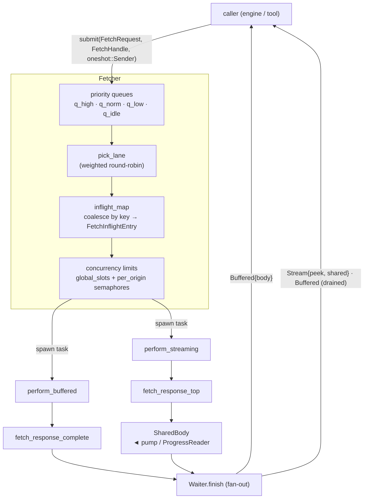

# gosub-sonar — Architecture

`gosub-sonar` is a **browser-agnostic, priority-scheduled HTTP/HTTPS fetching library**. It sits
between a browser engine (or any application) and the raw [`reqwest`] HTTP client, adding the
machinery a real browser needs on top of "just fetch a URL": prioritisation, request coalescing,
per-origin concurrency limits, cancellation, timeouts, streaming with fan-out to multiple
consumers, and a lifecycle event stream.

The crate is deliberately **engine-agnostic**: it knows nothing about tabs, DOM, or navigation. It
reaches back into its host only through two small traits — [`FetcherContext`](#fetchercontext) and
[`NetObserver`](#observability) — so the same fetcher can back a full browser, a CLI tool, or a
test harness.

This document is the top-level map. Two companion docs go deeper:

- [`net-design.md`](net-design.md) — narrative walk-through of the design decisions.
- [`pump.md`](pump.md) — the pump component that tees a body to a `SharedBody` and/or a file.

---

## Design goals

A naive `reqwest::get(url).await?.text().await?` works, but a browser network stack must also
handle:

1. **Non-blocking I/O** — network work never blocks the UI/main thread.
2. **Bounded memory** — large bodies stream rather than buffering wholesale.
3. **Coalescing** — concurrent requests for the same resource collapse into one fetch.
4. **Cancellation** — closing a tab or navigating away aborts in-flight work promptly.
5. **Priority** — the document matters more than a below-the-fold image.
6. **Robust errors & timeouts** — idle, total-body, connect, and request timeouts, plus a typed
   error model.

Each of these maps to a concrete component below.

---

## Crate layout

All source lives under `src/`. The library exposes three top-level modules (`http`, `net`,
`types`); everything interesting is in `net`.

| Module | File | Responsibility |
|--------|------|----------------|
| `net::fetcher` | `src/net/fetcher.rs` | **The scheduler.** Priority queues, coalescing, concurrency limits, task spawning. `Fetcher::{new, run, submit}`. |
| `net::fetch` | `src/net/fetch.rs` | Low-level fetch primitives: `fetch_response_top`, `fetch_response_complete`, redirect handling, `ProgressReader`, `NetPolicy`. |
| `net::fetcher_context` | `src/net/fetcher_context.rs` | `FetcherContext` trait — the host's hook into the fetch lifecycle (observers, ref tracking, URL policy, cookies). |
| `net::types` | `src/net/types.rs` | Core data model: `FetchRequest`(+builder), `FetchResult`, `FetchKeyData`, `FetchHandle`, `Priority`, `NetError`, `BodyStream`, … |
| `net::shared_body` | `src/net/shared_body.rs` | `SharedBody` — bounded fan-out byte stream with drop-on-lag per-subscriber queues. |
| `net::pump` | `src/net/pump.rs` | Drains an `AsyncRead` into a `SharedBody` and/or a file on disk (atomic temp-file + rename). |
| `net::utils` | `src/net/utils.rs` | `Waiter` (result fan-out to listeners), `stream_to_bytes`, `spawn_named`. |
| `net::events` | `src/net/events.rs` | `NetEvent` enum — lifecycle events emitted during a fetch. |
| `net::observer` | `src/net/observer.rs` | `NetObserver` trait — receives `NetEvent`s. |
| `net::null_emitter` | `src/net/null_emitter.rs` | `NullEmitter` — a no-op `NetObserver`. |
| `net::request_ref` | `src/net/request_ref.rs` | `RequestReference` — opaque host correlation tag (e.g. a tab id). |
| `net::simple` | `src/net/simple.rs` | One-shot `simple_get` / `sync_get` / `sync_fetch` for callers that don't need the scheduler. |
| `net::fs_utils` | `src/net/fs_utils.rs` | `temp_path_for` — same-directory temp file for atomic renames. |
| `net::test_support` | `src/net/test_support.rs` | In-process mock HTTP server (`TestServer` / `RouteConfig`), test-only. |
| `http::response` | `src/http/response.rs` | Simple `Response` struct returned by the blocking one-shot helpers. |
| `types` | `src/types.rs` | Crate-wide primitives: `PeekBuf`, `RequestId`. |

**Platform gating.** Tokio, `tokio-util`, `tokio-stream`, and the full `reqwest` feature set are
compiled only for non-`wasm32` targets (see `Cargo.toml`); `wasm32` gets a stripped `reqwest`. The
crate forbids `unsafe_code` and denies `todo!`/`unimplemented!`/`dbg!` and (outside tests)
`unwrap`/`expect`/`panic`.

---

## Two entry points

Pick based on how much control you need:

### 1. `net::simple` — one-shot, zero setup

```rust
let body: Bytes = net::simple::simple_get(&url).await?;   // async
let resp = net::simple::sync_fetch(&url)?;                 // blocking, own runtime+thread
```

No coalescing, no prioritisation, no observers. `sync_get`/`sync_fetch` each run on a dedicated OS
thread with their own current-thread Tokio runtime, so they are safe to call even from inside
another runtime (e.g. an HTML parser loading a stylesheet mid-parse). Bodies are capped at 10 MiB.

### 2. `net::fetcher::Fetcher` — the full scheduler

```rust
let fetcher = Arc::new(Fetcher::new(FetcherConfig::default(), ctx)?);
tokio::spawn({ let f = fetcher.clone(); async move { f.run(shutdown).await } });

let (tx, rx) = oneshot::channel();
fetcher.submit(request, handle, tx).await;
let result: FetchResult = rx.await?;
```

This is what a browser uses. The rest of this document describes it. See `examples/fetcher.rs` for
a complete runnable setup and `examples/fetcher_harness.rs` for a stress harness.

---

## Component diagram



> If your Markdown viewer doesn't render Mermaid, see the pre-rendered
> [architecture.svg](architecture.svg), or the same flow in words under
> [Request lifecycle](#request-lifecycle) below. The SVG is generated from the block above with
> `mmdc -i architecture.mmd -o architecture.svg`.

---

## Request lifecycle

End to end, a fetch through the scheduler goes:

1. **Submit.** The caller builds a [`FetchRequest`](#core-data-model) (URL, method, headers,
   priority, `streaming`, `auto_decode`, optional body/`max_bytes`) and calls
   `fetcher.submit(req, handle, reply_tx)`. The item is pushed onto the queue for its `Priority`
   and the run loop is woken via a `Notify`.

2. **Dequeue.** `Fetcher::run` picks the next item with `pick_lane` — a weighted round-robin over
   the four lanes (≈ High 8 : Normal 4 : Low 2 : Idle 1 across a 15-slot cycle). When the preferred
   lane is empty it falls through to the next lane in descending priority, so **no lane starves**
   while slots remain.

3. **Coalesce.** A key is computed from URL + method + headers (`FetchKeyData::generate`) plus the
   `auto_decode` flag. If an entry with that key already exists in `inflight_map`, this caller
   becomes a **follower**: it just registers a listener and returns. Otherwise it becomes the
   **leader** and creates a `FetchInflightEntry`.

4. **Acquire slots.** The leader spawns a fetch task that first acquires a global concurrency slot
   (`global_slots`, default 32) and then a per-origin slot (`h1_per_origin` = 6 for HTTP/1,
   `h2_per_origin` = 16 for HTTP/2). Both are semaphores; acquisition races against the shutdown
   token.

5. **Perform.** If **any** coalesced subscriber wants streaming, the task runs `perform_streaming`
   (→ `FetchResult::Stream` backed by a `SharedBody`); otherwise `perform_buffered`
   (→ `FetchResult::Buffered`). Both handle redirects, cookies, timeouts, and the URL policy.

6. **Fan-out.** The result is handed to the entry's `Waiter::finish`, which delivers it to every
   listener — cloning streams for streaming listeners and draining the `SharedBody` into a single
   buffer for buffered listeners (see [coalescing](#coalescing--fan-out)).

7. **Cleanup.** The entry's `done` token fires, it is removed from `inflight_map`, and
   `FetcherContext::on_ref_done` is called. The spawned task ends and the slots are released.

---

## Core data model

Defined in `src/net/types.rs` (and `src/types.rs`):

| Type | Role |
|------|------|
| `FetchRequest` | Everything about a request: `key_data` (URL/method/headers), `priority`, `streaming`, `auto_decode`, `body`, `max_bytes`, plus correlation fields (`reference`, `req_id`, `kind`, `initiator`). Build via `FetchRequest::builder(method, url)`. |
| `FetchKeyData` | The `{url, method, headers}` triple used as the **coalescing key**; `generate()` produces the string key, and `Hash`/`Display` are derived from it. |
| `FetchHandle` | Per-subscriber handle carrying that caller's `CancellationToken` — cancelling one caller does not cancel the shared fetch unless *all* callers cancel. |
| `FetchResult` | The outcome sent back: `Stream { meta, peek_buf, shared }`, `Buffered { meta, body }`, or `Error(NetError)`. |
| `FetchResultMeta` | Response metadata: `final_url`, `status`, `status_text`, `headers`, `content_length`, `content_type`, `has_body`. |
| `Priority` | `High` / `Normal` (default) / `Low` / `Idle`. |
| `ResourceKind`, `Initiator` | Classification tags used only for logging/observers — they do **not** affect scheduling. |
| `RequestReference` | Opaque host correlation id (`Background(u64)` / `Tagged(u64)`) — lets the host group requests (e.g. per tab) without the net layer knowing what a tab is. |
| `RequestId` | UUID identifying one logical request chain, stable across redirects. |
| `RequestBody` | Request payload with a content-type hint (`bytes`/`json`/`form`/`text` constructors). |
| `BodyStream` | An `AsyncRead` body wrapper (optionally seekable/clonable when backed by memory). |
| `PeekBuf` | The first bytes of a body (see [peek](#the-peek-buffer)). |
| `NetError` | Typed error enum (see [errors](#error-model)). |

---

## Scheduling & concurrency

The `Fetcher` holds four `VecDeque` lanes behind mutexes (`q_high`, `q_norm`, `q_low`, `q_idle`)
and two layers of semaphores:

- **`global_slots`** — a single `Semaphore` capping total concurrent fetches (default 32).
- **`per_origin`** — a `DashMap<origin, Semaphore>`, created on first use per origin, capping
  concurrent fetches to one origin (6 for HTTP/1, 16 for HTTP/2 — only HTTPS can negotiate HTTP/2
  via ALPN).

`FetcherConfig` (in `fetcher.rs`) also carries `connect_timeout` (5s), `req_timeout` (60s),
`read_idle_timeout` (15s), `total_body_timeout` (180s), and an optional `user_agent`. The fetcher
builds **two** `reqwest` clients: one with automatic gzip/brotli/deflate decoding (`auto_decode:
true`) and one that returns raw bytes (`auto_decode: false`); the flag is part of the coalescing
key so decoded and raw requests never merge.

---

## Coalescing & fan-out

The heart of the "one fetch, many consumers" behaviour lives in three pieces:

- **`FetchInflightEntry`** (`fetcher.rs`) — one per unique in-flight fetch. Tracks the `Waiter`,
  a `wants_streaming` flag, a subscriber count, and cancellation tokens (`parent_cancel` fires only
  when *all* subscribers cancel).
- **`Waiter`** (`utils.rs`) — the set of listeners. `register(tx, wants_streaming)` adds a listener;
  `finish(result)` delivers to all of them.
- **`SharedBody`** (`shared_body.rs`) — a bounded fan-out stream. Each subscriber has its own queue
  (capacity 32); a subscriber that can't keep up is **dropped** rather than stalling the producer.
  Subscribers see only *future* chunks (no replay).

**Streaming and buffered requests coalesce in both directions.** The coalescing key does not
distinguish them, so which mode runs is decided by the subscribers: if any asked for streaming, the
fetch runs as a stream. Then in `Waiter::finish`:

- A **`Buffered`** result is sent to every listener as-is.
- A **`Stream`** result is cloned to streaming listeners, and for buffered listeners the
  `SharedBody` is drained to its end into a single `Bytes` via `stream_to_bytes`. There is never a
  second network request or a second copy of the body.

---

## Streaming internals

### The peek buffer

Before the engine can decide how to treat a response (e.g. hand HTML to the parser), it needs the
headers and a sniff of the body. `fetch_response_top` returns a `ResponseTop { meta, peek_buf,
reader }` where `peek_buf` is the first **5 KiB** (`PEEK_MAX`) of the body. Because reading 5 KiB
off the socket may pull in slightly more, any surplus is stashed and the returned `reader` is
reconstructed to re-read that surplus first, so the caller sees a seamless body stream starting
exactly after the peek:

```
|--- peek buffer ---|---- excess ----|---- socket ----|
                    ^ new reader replays excess, then continues from the socket
```

### top vs complete

- **`fetch_response_top`** — headers + peek + a live reader for the tail. Used by
  `perform_streaming`.
- **`fetch_response_complete`** — reads the whole body into one contiguous `BytesMut` (pre-sized
  from `Content-Length` when known) and `freeze`s it into an `Arc`-backed `Bytes`. Single copy per
  chunk, zero-copy at the boundary. Used by `perform_buffered`. See the `READ_CHUNK` note in that
  file for why spare buffer capacity is reserved before each read.

### ProgressReader, pump, and SharedBody

For streaming, the tail reader is wrapped in a **`ProgressReader`** that emits `NetEvent::Progress`
per chunk and enforces cancellation, idle/total timeouts, and max-size limits. `SharedBody`
(via `from_reader`) spawns a background task that pumps the reader into per-subscriber queues. The
**pump** (`pump.rs`) is the higher-level driver that fans a body out to a `SharedBody` and/or a
file on disk — writing to a temp file and atomically renaming on success (see [`pump.md`](pump.md)).

---

## Cancellation & timeouts

Cancellation is layered with `tokio_util::sync::CancellationToken`:

- Each subscriber's `FetchHandle` carries its own token; when a caller cancels, its listener is
  removed and the subscriber count drops.
- The `FetchInflightEntry::parent_cancel` fires only when the *last* subscriber cancels, aborting
  the shared fetch.
- A `shutdown` token passed to `Fetcher::run` stops the whole scheduler and unblocks pending
  semaphore acquisitions.

Timeouts come from `FetcherConfig`: `connect_timeout` and `req_timeout` are enforced by `reqwest`;
`read_idle_timeout` (max gap between reads) and `total_body_timeout` (whole-body budget) are
enforced in the read loops of `fetch_response_complete` and the `ProgressReader`/`SharedBody` path.

---

## Security & policy

`NetPolicy` (in `fetch.rs`) is the safety hook, populated from the host via
`NetPolicy::from_context`:

- **`url_allowed`** — consulted for the initial URL *and every redirect target*; the place to
  implement SSRF guards, allow/block lists. Wired to `FetcherContext::is_url_allowed`.
- **`cookies_for`** — supplies the `Cookie` header per origin from the host's jar.

Redirects are handled manually in `get_with_redirects` (up to `MAX_REDIRECTS` = 20 hops) with
browser-matching semantics:

- Method/body downgraded on 301/302/303, preserved on 307/308 (RFC 7231 §6.4).
- `Authorization` and `Cookie` (`SENSITIVE_REDIRECT_HEADERS`) are stripped on cross-origin
  redirects (RFC 9110 §15.4), and the cookie jar is re-queried for the new origin.
- Only `http`/`https` targets are followed.

---

## Observability

Two traits decouple the net stack from the host's event system:

### NetObserver

`NetObserver::on_event(&self, ev: NetEvent)` receives lifecycle events. `NetEvent` variants:
`Started`, `Redirected`, `ResponseHeaders`, `Progress`, `Finished`, `Failed`, `Cancelled`,
`Warning`, `Io`. `NullEmitter` is a no-op implementation for callers that don't care.

### FetcherContext

Implemented by the host and passed to `Fetcher::new`. The bridge between scheduler and application:

- `observer_for(reference, req_id, kind, initiator)` — returns the `NetObserver` for a given
  request (lets the host route events per tab/resource).
- `on_ref_active` / `on_ref_done` — fired when a unique fetch becomes active and when its last
  subscriber finishes (outstanding-work tracking).
- `is_url_allowed(url)` — URL policy hook (default: allow all).
- `cookies_for(url)` — returns the `Cookie` header value for a request hop (default: none), wired
  into `NetPolicy::cookies_for`.
- `on_cookies_received(final_url, set_cookie_values)` — called after a response carrying
  `Set-Cookie` headers, so the host can update its jar.

All of `is_url_allowed`, `cookies_for`, and `on_cookies_received` have default implementations, so a
minimal context only has to provide `observer_for`, `on_ref_active`, and `on_ref_done`.

---

## Error model

`NetError` (`types.rs`) is the single error type, cheaply cloneable (`Arc`-wrapped payloads) so one
error can fan out to many listeners:

| Variant | Meaning |
|---------|---------|
| `Reqwest` | Underlying `reqwest` client error. |
| `Redirect` | Redirect resolution failed (missing `Location`, bad scheme, too many hops, blocked). |
| `Io` | I/O error reading the body. |
| `Cancelled` | Request cancelled. |
| `Timeout` | Idle or total-body timeout. |
| `Read` | Body read/assembly error (e.g. exceeded `max_bytes`). |
| `Other` | Anything else (e.g. URL blocked by policy). |

Errors are delivered as `FetchResult::Error(NetError)` to every coalesced listener.

---

## Where to go next

- Design rationale and narrative: [`net-design.md`](net-design.md)
- The pump component: [`pump.md`](pump.md)
- Runnable code: `examples/simple_fetch.rs`, `examples/fetcher.rs`, `examples/fetcher_harness.rs`

[`reqwest`]: https://docs.rs/reqwest
