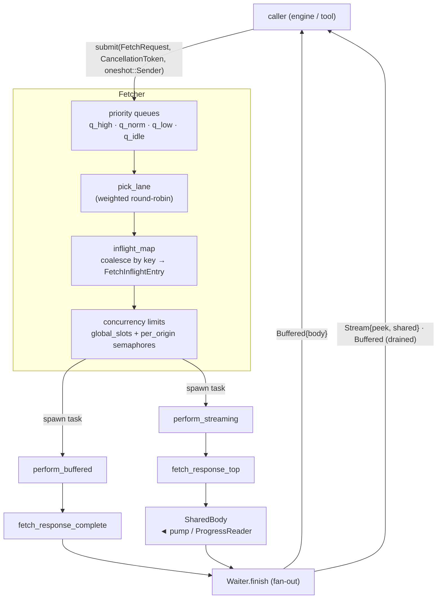

# gosub-sonar — Architecture

`gosub-sonar` is a **browser-agnostic, priority-scheduled HTTP/HTTPS fetching library**. It sits
between a browser engine (or any application) and the raw [`reqwest`] HTTP client, adding the
machinery a real browser needs on top of "just fetch a URL": prioritisation, request coalescing,
per-origin concurrency limits, cancellation, timeouts, streaming with fan-out to multiple
consumers, and a lifecycle event stream.

The crate is deliberately **engine-agnostic**: it knows nothing about tabs, DOM, or navigation. It
reaches back into its host only through two small traits — [`FetcherContext`](#fetchercontext) and
[`NetObserver`](#observability) — so the same fetcher can back a full browser, a CLI tool, or a
test harness.

This document is the top-level map. Two companion docs go deeper:

- [`net-design.md`](net-design.md) — narrative walk-through of the design decisions.
- [`pump.md`](pump.md) — the pump component that tees a body to a `SharedBody` and/or a file.

---

## Design goals

A naive `reqwest::get(url).await?.text().await?` works, but a browser network stack must also
handle:

1. **Non-blocking I/O** — network work never blocks the UI/main thread.
2. **Bounded memory** — large bodies stream rather than buffering wholesale.
3. **Coalescing** — concurrent requests for the same resource collapse into one fetch.
4. **Cancellation** — closing a tab or navigating away aborts in-flight work promptly.
5. **Priority** — the document matters more than a below-the-fold image.
6. **Robust errors & timeouts** — idle, total-body, connect, and request timeouts, plus a typed
   error model.

Each of these maps to a concrete component below.

---

## Crate layout

All source lives under `src/`. The library exposes three top-level modules (`http`, `net`,
`types`); everything interesting is in `net`.

| Module | File | Responsibility |
|--------|------|----------------|
| `net::fetcher` | `src/net/fetcher.rs` | **The scheduler.** Priority queues, coalescing, concurrency limits, task spawning. `Fetcher::{new, run, submit}`. |
| `net::fetch` | `src/net/fetch.rs` | Low-level fetch primitives: `fetch_response_top`, `fetch_response_complete`, redirect handling, `ProgressReader`, `NetPolicy`. |
| `net::fetcher_context` | `src/net/fetcher_context.rs` | `FetcherContext` trait — the host's hook into the fetch lifecycle (observers, ref tracking, URL policy, cookies). |
| `net::cors` | `src/net/cors.rs` | CORS (WHATWG Fetch): safelist predicates, the CORS check, preflight validation, response tainting/filtering. `CorsPreflightCache` / `InMemoryPreflightCache`. Enforcement is native-only. |
| `net::referrer` | `src/net/referrer.rs` | `Referer` header from a `ReferrerPolicy` (W3C Referrer Policy), recomputed per redirect hop. |
| `net::mixed_content` | `src/net/mixed_content.rs` | Blocking/upgrading insecure sub-resources of a secure document (W3C Mixed Content), checked per hop. `MixedContentPolicy`. |
| `net::fetch_metadata` | `src/net/fetch_metadata.rs` | `Origin` and `Sec-Fetch-Dest/Mode/Site/User` headers (W3C Fetch Metadata). `RequestDestination`, `RequestMode`, `SecFetchSite`. |
| `net::dns` | `src/net/dns.rs` | `DnsResolver` — pluggable name resolution (SSRF policies, pinned addresses). Native-only. |
| `net::proxy` | `src/net/proxy.rs` | `ProxyConfig` / `ProxyRule` — proxy settings, replacing the `*_PROXY` environment. Native-only. |
| `net::hsts` | `src/net/hsts.rs` | HTTP Strict Transport Security (RFC 6797): header parsing, host matching, expiry, URL upgrade. `HstsStore` / `InMemoryHstsStore`. Native-only. |
| `net::tls` | `src/net/tls.rs` | `TlsError` / `TlsErrorKind`: why a handshake failed (expired, unknown issuer, wrong host name, ...), extracted from the rustls error. Certificate overrides: `TlsOverrideStore` / `InMemoryTlsOverrideStore` and the verifier that consults them. Native-only. |
| `net::types` | `src/net/types.rs` | Core data model: `FetchRequest`(+builder), `FetchResult`, `FetchResultMeta`, `Priority`, `NetError`, `BodyStream`, … |
| `net::shared_body` | `src/net/shared_body.rs` | `SharedBody` — bounded fan-out byte stream with drop-on-lag per-subscriber queues. |
| `net::pump` | `src/net/pump.rs` | Drains an `AsyncRead` into a `SharedBody` and/or a file on disk (atomic temp-file + rename). |
| `net::utils` | `src/net/utils.rs` | `Waiter` (result fan-out to listeners), `stream_to_bytes`, `spawn_named`. |
| `net::events` | `src/net/events.rs` | `NetEvent` enum — lifecycle events emitted during a fetch. |
| `net::observer` | `src/net/observer.rs` | `NetObserver` trait — receives `NetEvent`s. |
| `net::null_emitter` | `src/net/null_emitter.rs` | `NullEmitter` — a no-op `NetObserver`. |
| `net::request_ref` | `src/net/request_ref.rs` | `RequestReference` — opaque host correlation tag (e.g. a tab id). |
| `net::simple` | `src/net/simple.rs` | One-shot `simple_get` / `sync_get` / `sync_fetch` for callers that don't need the scheduler. |
| `net::fs_utils` | `src/net/fs_utils.rs` | `temp_path_for` — same-directory temp file for atomic renames. |
| `net::test_support` | `src/net/test_support.rs` | In-process mock HTTP server (`TestServer` / `RouteConfig`); crate tests + `test-support` feature. |
| `http::response` | `src/http/response.rs` | Simple `Response` struct returned by the blocking one-shot helpers. |
| `types` | `src/types.rs` | Crate-wide primitives: `PeekBuf`, `RequestId`. |

**Platform gating.** The crate compiles for `wasm32-unknown-unknown` (CI checks it). On wasm32,
reqwest's fetch()-backed client replaces the native one — the browser owns TLS, connections,
redirects, cookies, and decompression — and tokio is limited to its wasm-supported features
(`sync`, `rt`, `time`, `io-util`, `macros`; no `net`). Facilities that need a filesystem or a
blockable thread are native-only: `net::pump`, `net::fs_utils`, `sync_get`/`sync_fetch`, `file://`
URLs, and `net::test_support`. Tasks spawn via `spawn_named`, which maps to `tokio::spawn`
natively and `tokio::task::spawn_local` on wasm32 (the embedder must drive a `LocalSet`).

**Lint posture.** The crate forbids `unsafe_code` and denies `todo!`/`unimplemented!`/`dbg!` and
(outside tests) `unwrap`/`expect`/`panic`.

---

## Two entry points

Pick based on how much control you need:

### 1. `net::simple` — one-shot, zero setup

```rust
let body: Bytes = net::simple::simple_get(&url).await?;   // async
let resp = net::simple::sync_fetch(&url)?;                 // blocking, own runtime+thread
```

No coalescing, no prioritisation, no observers. `sync_get`/`sync_fetch` each run on a dedicated OS
thread with their own current-thread Tokio runtime, so they are safe to call even from inside
another runtime (e.g. an HTML parser loading a stylesheet mid-parse). Bodies are capped at 10 MiB.

### 2. `net::fetcher::Fetcher` — the full scheduler

```rust
let fetcher = Arc::new(Fetcher::new(FetcherConfig::default(), ctx)?);
tokio::spawn({ let f = fetcher.clone(); async move { f.run(shutdown).await } });

let (tx, rx) = oneshot::channel();
fetcher.submit(request, handle, tx).await;
let result: FetchResult = rx.await?;
```

This is what a browser uses. The rest of this document describes it. See `examples/fetcher.rs` for
a complete runnable setup and `examples/fetcher_harness.rs` for a stress harness.

---

## Component diagram


```mermaid
flowchart TD
    caller["caller (engine / tool)"]

    subgraph fetcher["Fetcher"]
        queues["priority queues<br/>q_high · q_norm · q_low · q_idle"]
        pick["pick_lane<br/>(weighted round-robin)"]
        inflight["inflight_map<br/>coalesce by key → FetchInflightEntry"]
        slots["concurrency limits<br/>global_slots + per_origin semaphores"]
        queues --> pick --> inflight --> slots
    end

    complete["fetch_response_complete"]
    top["fetch_response_top"]
    shared["SharedBody<br/>◄ pump / ProgressReader"]
    waiter["Waiter.finish (fan-out)"]

    caller -->|"submit(FetchRequest, CancellationToken, oneshot::Sender)"| queues
    slots -->|"spawn task"| buffered["perform_buffered"]
    slots -->|"spawn task"| streaming["perform_streaming"]

    buffered --> complete --> waiter
    streaming --> top --> shared --> waiter

    waiter -->|"Buffered{body}"| caller
    waiter -->|"Stream{peek, shared} · Buffered (drained)"| caller
```

> If your Markdown viewer doesn't render Mermaid, see the pre-rendered
> [architecture.svg](architecture.svg), or the same flow in words under
> [Request lifecycle](#request-lifecycle) below. To regenerate the SVG, copy the block above into
> a scratch `architecture.mmd` and run `mmdc -i architecture.mmd -o architecture.svg -b transparent`.
> The block above is the source of truth; the `.mmd` is not kept.

---

## Request lifecycle

End to end, a fetch through the scheduler goes:

1. **Submit.** The caller builds a [`FetchRequest`](#core-data-model) (URL, method, headers,
   priority, `streaming`, `auto_decode`, optional body/`max_bytes`) and calls
   `fetcher.submit(req, handle, reply_tx)`. The item is pushed onto the queue for its `Priority`
   and the run loop is woken via a `Notify`.

2. **Dequeue.** `Fetcher::run` picks the next item with `pick_lane` — a weighted round-robin over
   the four lanes (≈ High 8 : Normal 4 : Low 2 : Idle 1 across a 15-slot cycle). When the preferred
   lane is empty it falls through to the next lane in descending priority, so **no lane starves**
   while slots remain.

3. **Upgrade & coalesce.** If [HSTS](#hsts) applies to the request URL it is rewritten to `https`
   before anything else, so an `http` and an `https` request for the same armed host share one
   entry instead of keying differently and running as two fetches; this also fixes the origin used
   for the per-origin limit below. A key is then computed from URL + method + headers
   (`FetchRequest::generate_request_key`) plus the `auto_decode` flag. If an entry with that key
   already exists in `inflight_map`, this caller becomes a **follower**: it just registers a
   listener and returns. Otherwise it becomes the **leader** and creates a `FetchInflightEntry`.

4. **Acquire slots.** The leader spawns a fetch task that first acquires a global concurrency slot
   (`global_slots`, default 32) and then a per-origin slot (`h1_per_origin` = 6 for HTTP/1,
   `h2_per_origin` = 16 once we've seen an HTTP/2 or HTTP/3 response from that origin). Both are
   semaphores; acquisition races against the shutdown token.

5. **Perform.** If **any** coalesced subscriber wants streaming, the task runs `perform_streaming`
   (→ `FetchResult::Stream` backed by a `SharedBody`); otherwise `perform_buffered`
   (→ `FetchResult::Buffered`). Both handle redirects, cookies, timeouts, and the URL policy.

6. **Fan-out.** The result is handed to the entry's `Waiter::finish`, which delivers it to every
   listener — cloning streams for streaming listeners and draining the `SharedBody` into a single
   buffer for buffered listeners (see [coalescing](#coalescing--fan-out)).

7. **Cleanup.** The entry's `done` token fires, it is removed from `inflight_map`, and
   `FetcherContext::on_ref_done` is called. The spawned task ends and the slots are released.

---

## Core data model

Defined in `src/net/types.rs` (and `src/types.rs`):

| Type | Role |
|------|------|
| `FetchRequest` | Everything about a request: `url`, `method`, `headers`, `priority`, `streaming`, `auto_decode`, `body`, `max_bytes`, plus correlation fields (`reference`, `req_id`, `kind`, `initiator`). Build via `FetchRequest::builder(method, url)`. `generate_request_key()` derives the **coalescing key** from url/method/headers; it returns `None` for methods other than GET/HEAD, which are never coalesced. |
| `FetchResult` | The outcome sent back: `Stream { meta, peek_buf, shared }`, `Buffered { meta, body }`, or `Error(NetError)`. |
| `FetchResultMeta` | Response metadata: `final_url`, `status`, `status_text`, `headers`, `content_length`, `content_type`, `has_body`. |
| `Priority` | `High` / `Normal` (default) / `Low` / `Idle`. |
| `ResourceKind`, `Initiator` | Classification tags used only for logging/observers — they do **not** affect scheduling. |
| `RequestReference` | Opaque host correlation id (`Background(u64)` / `Tagged(u64)`) — lets the host group requests (e.g. per tab) without the net layer knowing what a tab is. |
| `RequestId` | UUID identifying one logical request chain, stable across redirects. |
| `RequestBody` | Request payload with a content-type hint (`bytes`/`json`/`form`/`text` constructors). |
| `BodyStream` | An `AsyncRead` body wrapper (optionally seekable/clonable when backed by memory). |
| `PeekBuf` | The first bytes of a body (see [peek](#the-peek-buffer)). |
| `NetError` | Typed error enum (see [errors](#error-model)). |

---

## Scheduling & concurrency

The `Fetcher` holds four `VecDeque` lanes behind mutexes (`q_high`, `q_norm`, `q_low`, `q_idle`)
and two layers of semaphores:

- **`global_slots`** — a single `Semaphore` capping total concurrent fetches (default 32).
- **`per_origin`** — an `OriginTable` (`DashMap<origin, OriginSlots>`), created on first use per
  origin, capping concurrent fetches to one origin. Starts at the HTTP/1 limit (6) and is grown
  to the HTTP/2 limit (16) once an HTTP/2 or HTTP/3 response has been seen from that origin
  (reported per hop via `NetPolicy::on_protocol`; native only, wasm32 stays at the HTTP/1 limit).

`FetcherConfig` (in `fetcher.rs`) also carries `connect_timeout` (5s), `req_timeout` (60s),
`read_idle_timeout` (15s), `total_body_timeout` (180s), a `user_agent` (defaults to
`gosub-sonar/<crate version>`), and a `proxy`
(`proxy.rs`) that defaults to reading `HTTP_PROXY` and friends from the environment. The fetcher
builds **two** `reqwest` clients: one with automatic gzip/brotli/deflate decoding (`auto_decode:
true`) and one that returns raw bytes (`auto_decode: false`); the flag is part of the coalescing
key so decoded and raw requests never merge.

---

## Coalescing & fan-out

The heart of the "one fetch, many consumers" behaviour lives in three pieces:

- **`FetchInflightEntry`** (`fetcher.rs`) — one per unique in-flight fetch. Tracks the `Waiter`,
  a `wants_streaming` flag, a subscriber count, and cancellation tokens (`parent_cancel` fires only
  when *all* subscribers cancel).
- **`Waiter`** (`utils.rs`) — the set of listeners. `register(tx, wants_streaming)` adds a listener;
  `finish(result)` delivers to all of them.
- **`SharedBody`** (`shared_body.rs`) — a bounded fan-out stream. Each subscriber has its own queue
  (capacity 32); a subscriber that can't keep up is **dropped** rather than stalling the producer.
  Subscribers see only *future* chunks (no replay), but the pump doesn't start reading until the
  first subscriber attaches, so that one always gets the whole body.

**Streaming and buffered requests coalesce in both directions.** The coalescing key does not
distinguish them, so which mode runs is decided by the subscribers: if any asked for streaming, the
fetch runs as a stream. Then in `Waiter::finish`:

- A **`Buffered`** result is sent to every listener as-is.
- A **`Stream`** result is cloned to streaming listeners, and for buffered listeners the
  `SharedBody` is drained to its end into a single `Bytes` via `stream_to_bytes`. There is never a
  second network request or a second copy of the body.

---

## Streaming internals

### The peek buffer

Before the engine can decide how to treat a response (e.g. hand HTML to the parser), it needs the
headers and a sniff of the body. `fetch_response_top` returns a `ResponseTop { meta, peek_buf,
reader }` where `peek_buf` is the first **5 KiB** (`PEEK_MAX`) of the body. Because reading 5 KiB
off the socket may pull in slightly more, any surplus is stashed and the returned `reader` is
reconstructed to re-read that surplus first, so the caller sees a seamless body stream starting
exactly after the peek:

```
|--- peek buffer ---|---- excess ----|---- socket ----|
                    ^ new reader replays excess, then continues from the socket
```

### top vs complete

- **`fetch_response_top`** — headers + peek + a live reader for the tail. Used by
  `perform_streaming`.
- **`fetch_response_complete`** — reads the whole body into one contiguous `BytesMut` (pre-sized
  from `Content-Length` when known) and `freeze`s it into an `Arc`-backed `Bytes`. Single copy per
  chunk, zero-copy at the boundary. Used by `perform_buffered`. See the `READ_CHUNK` note in that
  file for why spare buffer capacity is reserved before each read.

### ProgressReader, pump, and SharedBody

For streaming, the tail reader is wrapped in a **`ProgressReader`** that emits `NetEvent::Progress`
per chunk and enforces cancellation, idle/total timeouts, and max-size limits. `SharedBody`
(via `from_reader`) spawns a background task that pumps the reader into per-subscriber queues. The
**pump** (`pump.rs`) is the higher-level driver that fans a body out to a `SharedBody` and/or a
file on disk — writing to a temp file and atomically renaming on success (see [`pump.md`](pump.md)).

---

## Cancellation & timeouts

Cancellation is layered with `tokio_util::sync::CancellationToken`:

- Each subscriber passes its own `CancellationToken` to `submit`; when a caller cancels, its
  listener is removed and the subscriber count drops. Cancelling one caller does not cancel the
  shared fetch.
- The `FetchInflightEntry::parent_cancel` fires only when the *last* subscriber cancels, aborting
  the shared fetch.
- A `shutdown` token passed to `Fetcher::run` stops the whole scheduler and unblocks pending
  semaphore acquisitions.

Timeouts come from `FetcherConfig`: `connect_timeout` and `req_timeout` are enforced by `reqwest`;
`read_idle_timeout` (max gap between reads) and `total_body_timeout` (whole-body budget) are
enforced in the read loops of `fetch_response_complete` and the `ProgressReader`/`SharedBody` path.

---

## Security & policy

`NetPolicy` (in `fetch.rs`) is the safety hook, populated from the host via
`NetPolicy::from_context`:

- **`url_allowed`** — consulted for the initial URL *and every redirect target*; the place to
  implement SSRF guards, allow/block lists. Wired to `FetcherContext::is_url_allowed`.
- **`cookies_for`** — supplies the `Cookie` header per origin from the host's jar.
- **`hsts`** — the [HSTS](#hsts) store, consulted to upgrade each hop and updated from each hop's
  response. Set from `FetcherConfig::hsts` rather than `FetcherContext`; `None` disables HSTS.
- **`cors_preflight`** — the [CORS](#cors) preflight-grant cache, consulted before sending a
  preflight `OPTIONS` and updated from its response. Set from
  `FetcherConfig::cors_preflight_cache`; `None` keeps CORS enforced but preflights every time.

`FetcherConfig::dns_resolver` (`net::dns`) is the other SSRF hook, outside `NetPolicy`. When set
it is the only resolver the client uses, for every connection including redirect hops, and the
connection goes to exactly the addresses it returns (a rebound name can't redirect a pooled
connection). Return `Err` to refuse a host. `url_allowed` checks URLs, the resolver checks
addresses; a policy usually wants both. Native-only.

Redirects are handled manually in `get_with_redirects` (up to `MAX_REDIRECTS` = 20 hops) with
browser-matching semantics:

- Method/body downgraded on 301/302/303, preserved on 307/308 (RFC 7231 §6.4).
- `Authorization` and `Cookie` (`SENSITIVE_REDIRECT_HEADERS`) are stripped on cross-origin
  redirects (RFC 9110 §15.4), and the cookie jar is re-queried for the new origin.
- Only `http`/`https` targets are followed.
- Each hop is upgraded to `https` if HSTS applies, *before* `url_allowed` is consulted, so the
  hook sees the URL that will actually be requested and no plaintext request is ever opened.
- Every hop's response is checked for `Strict-Transport-Security`, not just the final one.
- [CORS](#cors) is enforced per hop when the request carries an initiating origin: mode rules
  before sending, a preflight when the method/headers need one, the CORS check on every response
  of a cors-tainted chain, and a refusal of `Location` targets with embedded credentials.
- `Referer`, `Origin` and the `Sec-Fetch-*` headers are recomputed per hop, and the
  [mixed content](#referrer-mixed-content--fetch-metadata) check runs per hop.

> reqwest's own redirect following must stay disabled (`Policy::none()` in `build_client`). If it
> is re-enabled, reqwest resolves each 3xx internally and `get_with_redirects` only ever sees the
> final response, so none of the above runs. Pinned by
> `fetcher_url_policy_is_applied_to_redirect_targets`.

---

## CORS

`net::cors` implements Cross-Origin Resource Sharing per the WHATWG Fetch spec. The crate owns
the *mechanism* because only the redirect loop sees intermediate hops — the CORS check must run
on every one of them. The embedder owns the *policy* through request fields:

- **Inert without an origin.** No `FetchRequest::origin` → no CORS anywhere, same rule as mixed
  content. A CLI embedder never meets it.
- **`RequestMode` selects the regime.** `SameOrigin` refuses cross-origin targets; `NoCors` (the
  default) allows cross-origin loads only in the shape markup can produce (safelisted method, no
  custom headers) and marks the response opaque; `Cors` runs the full check plus preflight;
  `Navigate` and `Websocket` are exempt.
- **`RequestCredentials`** (`Omit` / `SameOrigin` / `Include`, default `Include`) gates the
  cookie-jar injection per hop and selects the credentialed CORS rules (exact origin echo +
  `Access-Control-Allow-Credentials`, no wildcards).
- **Preflights** (`OPTIONS` + `Access-Control-Request-*`) are sent per hop when the method or
  headers need approval, and their grants cached in `FetcherConfig::cors_preflight_cache`
  (`CorsPreflightCache` trait, in-memory default, `Access-Control-Max-Age` honored with a 2h
  cap). Re-preflighting after a redirect matches modern browser behaviour.
- **Tainting is annotated, never enforced by hiding data.** `FetchResultMeta::tainting` says
  what scripts may read (`Basic`/`Cors`/`Opaque`); `readable_headers()` computes that view. The
  full response always reaches the embedder — it must render opaque ``s and can build
  body-sniffing policies (ORB) on top of the annotation. Enforcing script visibility is the
  embedder's job.

Failures surface as `NetError::Blocked { reason: BlockReason::Cors(CorsError), .. }` with a
typed `CorsError` naming the violated rule, and a `NetEvent::CorsPreflight` /
`NetEvent::CorsPreflightDone` pair brackets each preflight for devtools-style observability —
the second carries how long the `OPTIONS` round-trip took, and is emitted for any response that
came back, including one that then fails validation.

Enforcement is native-only: on wasm32 the browser's `fetch()` enforces CORS itself and hides the
`Access-Control-*` response headers the checks would need.

---

## Referrer, mixed content & fetch metadata

Three smaller policies next to CORS. Like CORS they need `FetchRequest::origin` (the initiating
document) and do nothing without it, and they are recomputed on every redirect hop in
`get_with_redirects`, since same-origin, same-site and downgrade depend on the target.

**Referrer policy** (`net::referrer`). `FetchRequest::referrer` is the initiating document's URL
and `FetchRequest::referrer_policy` its policy; the `Referer` header is computed from those per
hop. Default is `strict-origin-when-cross-origin` like browsers: full URL within the origin, only
the origin when leaving it, nothing on an https → http downgrade. A `Referrer-Policy` header on a
3xx response replaces the policy for the rest of the chain.

**Mixed content** (`net::mixed_content`). A request from a secure origin to an insecure URL is
blocked (`BlockReason::MixedContent`) or upgraded to https, per `FetcherConfig::mixed_content`
(default `Block`) or the per-request `FetchRequest::mixed_content`. Sonar only does the per-hop
check, which the caller can't do itself: a check before `fetch()` never sees an `https://a` →
`http://b` redirect. Whether an image counts as optionally-blockable and may go through with
`MixedContentPolicy::Allow` is up to the embedder.

**Fetch metadata** (`net::fetch_metadata`). `Sec-Fetch-Dest`, `-Mode`, `-Site` and `-User` are
set from `FetchRequest::destination`, `::mode` and `Initiator::User`; `Origin` is sent on
non-GET/HEAD and cross-origin CORS requests. `Sec-Fetch-Site` compares registrable domains (public
suffix list, `psl` crate) and can only degrade across a chain; `Origin` becomes `null` after a
tainting cross-origin redirect. The fetcher overwrites hand-set values for these headers, like
browsers do for forbidden header names.

On wasm32 all three are inert: the browser follows redirects itself and applies its own policies.

---

## HSTS

A site that sends `Strict-Transport-Security` over HTTPS is recorded; later `http://` requests to
it are rewritten to `https://` before any connection is opened. RFC 6797, dynamic part only — no
preload list.

`net::hsts` owns the protocol: header parsing, host matching, expiry, and the URL rewrite. An
embedder implements `HstsStore` (`load` / `store` / `remove`, keyed by host) and nothing else. The
store is a plain map; the crate ignores entries past `expires_at` even if `load` returns them.

```rust
// In-memory store, enforced by default.
let cfg = FetcherConfig::default();

// Persist across restarts.
let cfg = FetcherConfig { hsts: Some(Arc::new(MyStore::open(&profile)?)), ..Default::default() };

// Private browsing: nothing consulted, nothing recorded.
let cfg = FetcherConfig { hsts: None, ..Default::default() };
```

`load` runs once per host label on every hop of every request, so it must not block — keep an
in-memory map and persist asynchronously.

Semantics, each covered by a test in `hsts.rs`:

- `includeSubDomains` gates inherited matches only; an exact match ignores it. Per §8.2 a host is
  a Known HSTS Host given a congruent match *or* any superdomain match asserting the flag, so a
  nearer non-matching entry does not shadow a permissive ancestor.
- A header received over plaintext is ignored (§8.1).
- `max-age=0` deletes the entry rather than storing an expired one (§6.1.1).
- An implicit port or `:80` becomes 443; any other explicit port is preserved (§8.3), so
  `http://x:8080/` upgrades to `https://x:8080/`.
- IP literals never match.

Upgrades happen in `Fetcher::run` before the coalescing key is derived
([lifecycle](#request-lifecycle) step 3), and in `get_with_redirects` per hop before the URL policy
check ([security & policy](#security--policy)).

Native-only: on wasm32 the browser's `fetch()` applies its own HSTS, and CORS filtering hides the
response header.

Testing: HSTS ignores plaintext responses and IP-literal hosts, so the plain mock server on
127.0.0.1 cannot arm a store. `TestServer::tls(domain)` serves HTTPS with a generated certificate —
trust it via `cert_pem()` and point the client at `socket_addr()` with reqwest's `resolve`. An
`#[ignore]`d live check runs against `hsts.badssl.com` (`cargo test -- --ignored hsts_live`).

---

## TLS errors & overrides

A failed handshake fails the request with `NetError::Tls(TlsError)`: kind (`Expired`,
`UnknownIssuer`, `HostnameMismatch`, ...), host and the rustls message, taken from the
`rustls::Error` at the bottom of reqwest's error chain. Observers get `NetEvent::TlsFailed`.

Set `FetcherConfig::tls_overrides` to a `TlsOverrideStore` to allow "proceed anyway". The
fetcher then builds its own rustls config (`tls::client_config`) with a verifier wrapping the
platform one. When verification fails it:

1. gives up unless it's a certificate error (`TlsErrorKind::is_certificate_error`);
2. refuses if the host is a known HSTS host (RFC 6797 §12.1);
3. accepts if the store has this (host, fingerprint);
4. otherwise asks `FetcherContext::tls_override(&error)`, and records a `true` in the store.

The `TlsError` from this path includes the certificate (DER) and its SHA-256 fingerprint. Usual
flow: request fails, show the certificate, on "proceed" call `store.accept(host, fingerprint)`
and retry. Overrides are per (host, certificate); revoking only affects new connections.

```rust
let overrides = Arc::new(InMemoryTlsOverrideStore::new());
let cfg = FetcherConfig { tls_overrides: Some(overrides.clone()), ..Default::default() };
// ... on NetError::Tls(e) and the user clicking through:
overrides.accept(&e.host, e.fingerprint.unwrap());
```

Native-only. Testing: `TestServer::tls` is self-signed, so the platform verifier rejects it;
`cert_der()` gives the certificate to compare fingerprints against.

---

## Observability

Two traits decouple the net stack from the host's event system:

### NetObserver

`NetObserver::on_event(&self, ev: NetEvent)` receives lifecycle events. `NetEvent` variants:
`Started`, `Redirected`, `ResponseHeaders`, `Progress`, `Finished`, `Failed`, `Cancelled`,
`Blocked`, `TlsFailed`, `CorsPreflight`, `CorsPreflightDone`, `DnsResolved`, `Connected`,
`Warning`, `Io`. `NullEmitter` is a no-op implementation for callers that don't care.

`NetEvent` is `#[non_exhaustive]`: a `match` over it needs a catch-all arm, and new events can
be added without a breaking release.

**Terminal events.** Every request ends in exactly one of `Finished`, `Failed`, or `Cancelled`.
`Failed` is emitted for any failure wherever it happened; the events that name a specific cause
— `Blocked`, `TlsFailed` — are emitted first and carry the detail, so an observer can treat
`Failed` as "this request is over" without matching every cause it might have. A cancelled
request is not a failure and reports only `Cancelled`.

**Timing events.** `DnsResolved`, `Connected`, and the `CorsPreflight`/`CorsPreflightDone` pair
each carry an `elapsed`, so the embedder can break the time before the first byte into
resolution, connection setup, and preflight instead of seeing one opaque gap.
`ResponseHeaders` marks time-to-first-byte and `Finished` carries the total, so the whole
waterfall is reconstructable.

They **nest rather than tile**: resolution happens inside reqwest's connector and the connect
timing wraps that connector, so `Connected` encloses `DnsResolved`, and the durations
deliberately do not add up to the elapsed total.

They also report only work that actually happened: a request served from the connection pool
emits no `DnsResolved` and no `Connected`, and a hop covered by a cached CORS grant emits no
preflight events — the absence is the answer, rather than a zero that would read as "instant".
`DnsResolved` further requires a `FetcherConfig::dns_resolver`, because reqwest's built-in
resolution sits below this crate and cannot be timed; `dns::SystemResolver` is the policy-free
resolver for embedders that only want the timing. All three are native-only: on wasm32 the browser owns resolution,
connection setup, and preflighting alike.

`Connected` is produced by a tower `connector_layer` (`net::connect_timing`) wrapped around
reqwest's connector, and `DnsResolved` from inside the resolver. Both sit below the request
layer, where the request's observer is not in scope, so `net::observer::CURRENT_OBSERVER` — a
`tokio::task_local` bound for the duration of the HTTP exchange — carries the right observer
down. Task-local rather than thread-local because a fetch may resume on a different worker
thread between polls. `Connected` carries no host: reqwest's connector request type is opaque,
and the observer receiving it is the attribution that matters.

### FetcherContext

Implemented by the host and passed to `Fetcher::new`. The bridge between scheduler and application:

- `observer_for(reference, req_id, kind, initiator)` — returns the `NetObserver` for a given
  request (lets the host route events per tab/resource).
- `on_ref_active` / `on_ref_done` — fired when a unique fetch becomes active and when its last
  subscriber finishes (outstanding-work tracking).
- `is_url_allowed(url)` — URL policy hook (default: allow all).
- `cookies_for(url)` — returns the `Cookie` header value for a request hop (default: none), wired
  into `NetPolicy::cookies_for`.
- `on_cookies_received(final_url, set_cookie_values)` — called after a response carrying
  `Set-Cookie` headers, so the host can update its jar.
- `tls_override(error)` — whether to accept a certificate that failed verification (default:
  no). Only used with `FetcherConfig::tls_overrides`; see
  [TLS errors & overrides](#tls-errors--overrides).

All of `is_url_allowed`, `cookies_for`, `on_cookies_received`, and `tls_override` have default
implementations, so a minimal context only has to provide `observer_for`, `on_ref_active`, and
`on_ref_done`.

---

## Error model

`NetError` (`types.rs`) is the single error type, cheaply cloneable (`Arc`-wrapped payloads) so one
error can fan out to many listeners:

| Variant | Meaning |
|---------|---------|
| `Reqwest` | Underlying `reqwest` client error. |
| `Tls` | TLS handshake failed. Carries a `TlsError` (kind, host, message, and with overrides enabled the certificate and fingerprint); also emitted as `NetEvent::TlsFailed`. Native-only. |
| `Redirect` | Redirect resolution failed (missing `Location`, bad scheme, too many hops, blocked). |
| `Io` | I/O error reading the body. |
| `Cancelled` | Request cancelled. |
| `Timeout` | Idle or total-body timeout. |
| `Read` | Body read/assembly error (e.g. exceeded `max_bytes`). |
| `Other` | Anything else (e.g. URL blocked by policy). |

Errors are delivered as `FetchResult::Error(NetError)` to every coalesced listener.

---

## Where to go next

- Design rationale and narrative: [`net-design.md`](net-design.md)
- The pump component: [`pump.md`](pump.md)
- Runnable code: `examples/simple_fetch.rs`, `examples/fetcher.rs`, `examples/fetcher_harness.rs`

[`reqwest`]: https://docs.rs/reqwest
