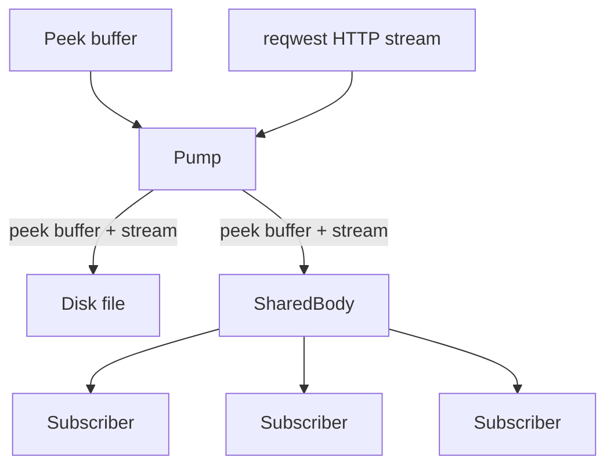

# Pump

> Part of the wider network stack — see [`architecture.md`](architecture.md) for the full picture
> and [`net-design.md`](net-design.md) for the design narrative.

The pump component moves stream data from a HTTP response over to different 
locations. These locations are called `PumpTargets`. At the moment there can
be only one target, but each target has two different (optional) destinations:

- a shared body reader
- a disk file

A pump will receive the peek buffer of a HTTP response (it's first 5KB of 
data), plus the stream data that follows. These two will be combined into a 
single stream of file and pushed out to the target.

A shared body has the property that multiple subscribers can listen to it. So
it's possible to have multiple listeners listening to the same stream of data.
When the pump is done, the shared body will be closed and all listeners will be
notified.

If a stream in the shared body is not read fast enough, the pump will close and
remove the target. This is to prevent a slow reader from blocking the entire
system.

> If your Markdown viewer doesn't render Mermaid, see the pre-rendered [pump.svg](pump.svg). In
> words: the peek buffer and the reqwest HTTP stream are combined by the pump, which writes the
> same "peek + stream" bytes to a disk file and/or a `SharedBody`; the `SharedBody` fans the data
> out to any number of subscribers.
